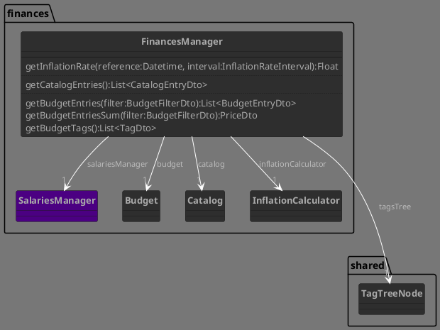
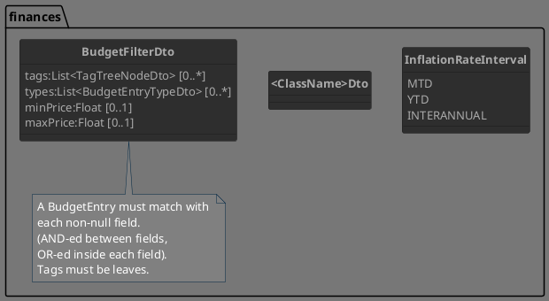
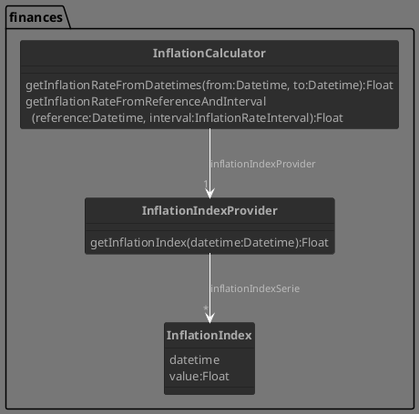
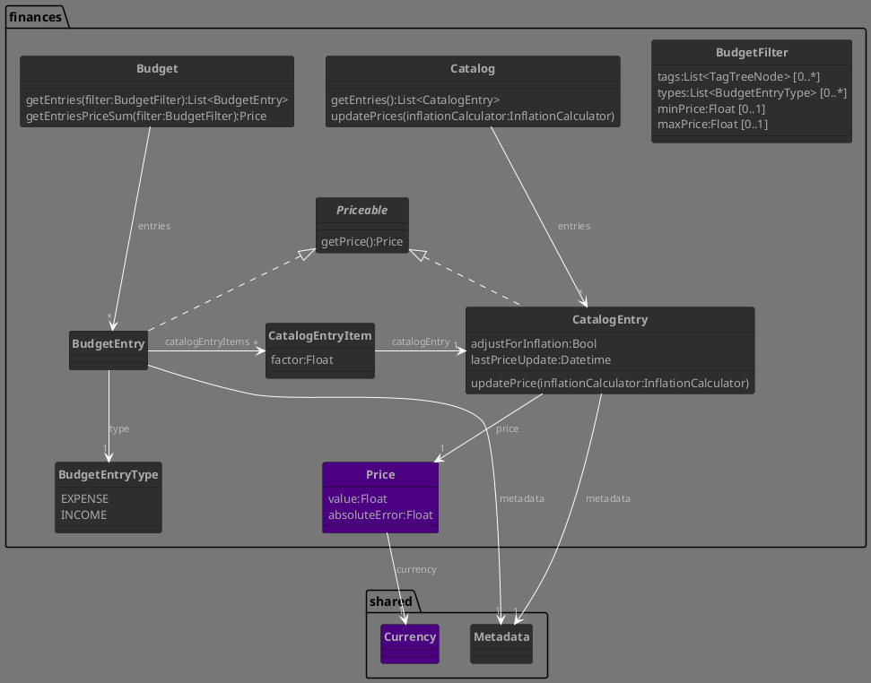

# Finances

- CER ratio source
  - Use BCRA api
    _Why?_
    - _Because it's daily updated_
    - _datos.gob is not daily updated but with the same frequency as IPC, regardless what they say on the serie description (tested)_

## Facade, main components, dtos

## Inflation

## Budget

