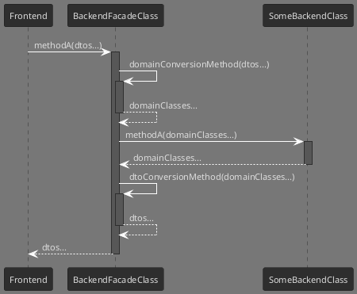

# General
## Language
- Dart
  _Discarded: Java, Typescript_
  _Why?_
  - _Preferences:_
    - _Static types_
    - _Nullable values_

## Generic workflow between layers

- Classes used to transfer data
  - Inside frontend: dtos
  - Between backend and frontend: dtos
  - Inside backend: domain classes
    _Inside excludes the facade_

- Scopes, responsabilities, etc.
  - Frontend only calls facade methods
  - Facade only makes dto-domain/domain-dto conversions
    _Include a wrapped class if necessary_
  - All non-native classes, enums, etc. has its corresponding dto
    _The simplicity is not an exception_

_Note that it's like a json approach but using static structures_

## Backend
- Classes has public fields to allow Db to create them
- Dtos has just the structure
  _Any logic, including simple calcs, constructors or operators, must be in other class_
  _Remember, they are just "static jsons"_

## Frontend
  - C, U and D methods are achieved directly on db for now

## Db
  - References are solved by Db class in a single way
  - Constructors of composite classes always recieve the components already made
  _Discarded: Creator pattern, because it adds coupling in the constructors and it violates the decision above_

## Style
- Errors
  - Describe what you must do
  _E.g.: "field must be greater than 0"_
  _Don't describe what is wrong_
  _E.g.: "field is less than or equals 0"_
- Comments
  - Same as errors
  