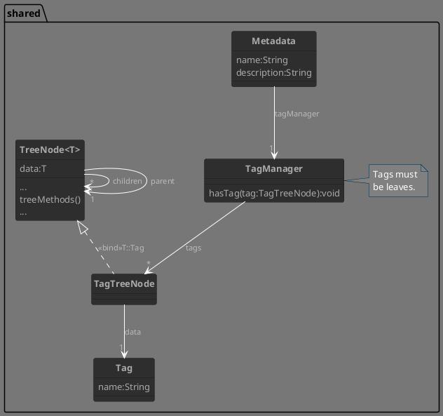
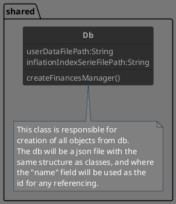

# Shared

## Metadata

- Tagging will be solved like this:
  - The user must
    - Create the tagsTree in the json file
      - The tree ensures partitions and unambiguous situations
      - Flat tags are just leaf tags that comes from the root node
    - Add leaf tags to entries
  - An tagged-object, through a TagManager, will hold multiple leaf tags
    - TagManager will check, at creation, that they are leaves
  - Tags are always used through TagTreeNode
    _Even if, for example, backends actually needs Tag objects only, not TagTreeNode ones, because the comparisons it has to make are simple since all tags are leaves_
    _This is to simplify the problem_

## Db

