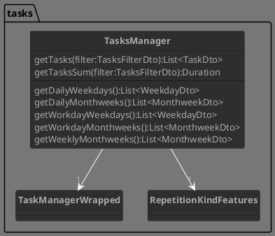
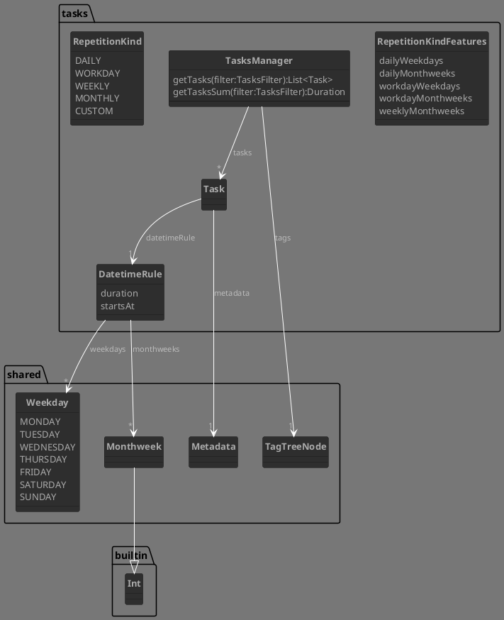

# Tasks

## Facade, main components, dtos

```plantuml
@startuml lifeAdminModel
!theme reddress-darkblue
skinparam classAttributeIconSize 0
hide circle
<style>
  classDiagram {
    fontname "Arial"
    header {
      fontstyle bold
      fontsize 15
    }
    class {
      fontsize 13
    }
    note {
      fontsize 13
      backgroundColor grey
    }
  }
</style>

package tasks {}

class "tasks.<ClassName>Dto"

class tasks.TasksFilterDto {
  weekdays
  monthweeks
}

@enduml
```

## Tasks

> A **task** is an activity that occurs at least once a day.

_If some activity is repeated inside a day, think on it as different tasks named like "first \<actvity\>", "second \<activity\>", etc._

